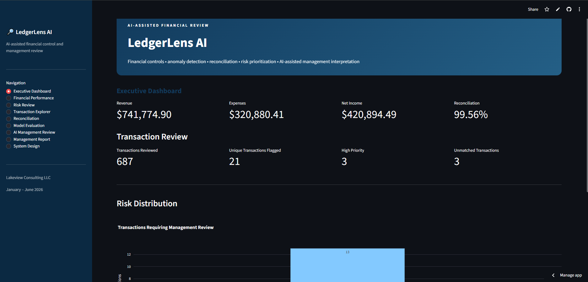
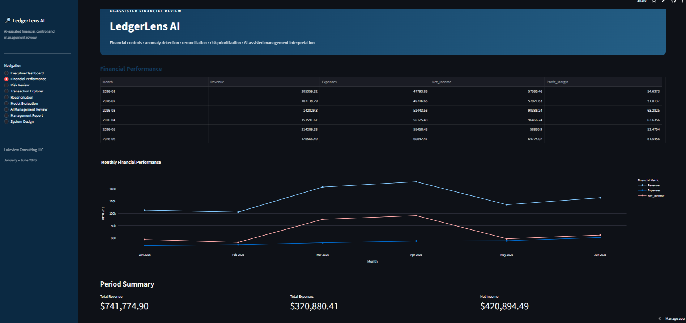
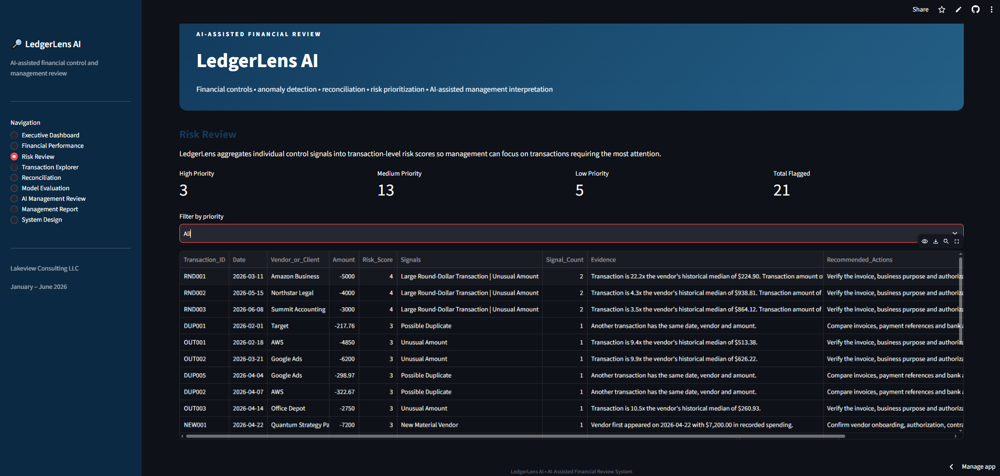
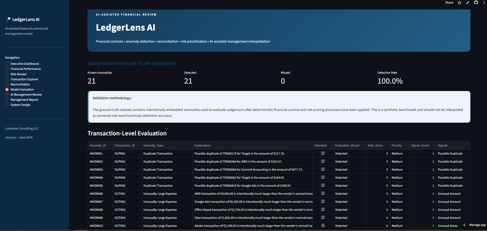

# 🔎 LedgerLens AI

### AI-Assisted Financial Control, Anomaly Detection, Reconciliation, Risk Prioritization, and Management Review System

LedgerLens AI is an end-to-end financial review system designed to analyze transaction-level accounting data, identify potential control exceptions, prioritize transactions for human review, reconcile ledger activity against banking records, evaluate detection performance against known test anomalies, and convert verified analytical results into management-oriented financial commentary using generative AI.

The system intentionally separates **deterministic financial analytics** from **generative AI interpretation**.

LedgerLens determines what the data shows.

Gemini helps communicate those verified results to management.

---

## 🎯 Project Objective

Traditional financial review can require analysts to manually examine hundreds or thousands of transactions to identify unusual activity, duplicates, classification issues, reconciliation differences, and other control exceptions.

LedgerLens was built to demonstrate how financial analytics and AI can work together to make this process more efficient.

The system follows a structured pipeline:

**Transaction Data → Financial Controls → Anomaly Detection → Risk Scoring → Reconciliation → Independent Validation → Gemini Interpretation → Management Review**

The objective is not to automatically declare transactions fraudulent or incorrect.

Instead, LedgerLens identifies transactions that warrant additional human review and provides evidence supporting that prioritization.

---

## 🏗️ System Architecture

LedgerLens uses two distinct analytical layers.

### 1. Deterministic Analytical Engine

Python-based financial controls perform the underlying calculations and identify potential exceptions.

These controls include:

- unusually large transaction detection
- vendor-level spending analysis
- duplicate transaction detection
- category consistency testing
- new material vendor identification
- large round-dollar transaction detection
- transaction-level risk scoring
- priority classification
- bank reconciliation
- monthly financial performance analysis

The deterministic engine produces structured analytical outputs before any generative AI is used.

### 2. Generative AI Interpretation Layer

Google Gemini receives selected verified analytical outputs and converts them into a management-oriented financial and internal-control review.

Gemini is used for:

- executive-level interpretation
- summarizing financial performance
- explaining control findings
- translating analytical results into business language
- suggesting areas requiring management follow-up

Gemini does **not** independently determine whether a transaction is fraudulent, erroneous, or unauthorized.

The underlying findings originate from LedgerLens' deterministic analytical controls.

---

## 📊 Interactive Streamlit Application

LedgerLens is deployed through an interactive Streamlit interface.

The application contains multiple analytical views:

### Executive Dashboard

Provides management with a high-level overview of:

- total revenue
- total expenses
- net income
- reconciliation rate
- transactions reviewed
- unique transactions flagged
- high-priority findings
- unmatched transactions
- risk distribution

### Financial Performance

Displays monthly:

- revenue
- expenses
- net income
- profit margins
- financial trends

### Risk Review

Allows users to examine transactions requiring management review according to their calculated risk level and underlying control signals.

### Transaction Explorer

Provides transaction-level visibility into the underlying financial dataset and analytical results.

### Reconciliation

Summarizes ledger-to-bank reconciliation results and identifies unmatched transactions requiring investigation.

### Model Evaluation

Compares LedgerLens results against intentionally embedded ground-truth anomalies in the synthetic evaluation dataset.

### AI Management Review

Sends verified analytical context to Google Gemini and generates a management-oriented interpretation of the results.

### Management Report

Provides a consolidated financial and internal-control review for management.

### System Design

Explains the architecture and separation between deterministic analytics and generative AI interpretation.

---

## 🖥️ Application Preview

LedgerLens is deployed as an interactive Streamlit application that allows users to move from high-level financial performance to transaction-level control analysis, reconciliation, model validation, and AI-assisted management interpretation.

### Executive Dashboard

The executive dashboard provides a consolidated view of financial performance, transaction-review activity, reconciliation results, and the distribution of transactions requiring management attention.



### Financial Performance

The financial-performance view analyzes revenue, expenses, net income, margins, and monthly financial trends across the reporting period.



### Risk Review

The risk-review interface presents transactions identified by LedgerLens' deterministic financial controls and prioritizes them according to the strength and combination of their control indicators.



### Model Evaluation

The model-evaluation view compares LedgerLens' identified exceptions against intentionally embedded ground-truth anomalies in the synthetic demonstration dataset. This provides an independent benchmark for evaluating the deterministic detection process.



### AI-Assisted Management Review

LedgerLens can pass verified analytical results to Google Gemini to generate management-oriented financial and internal-control commentary. The generative AI layer interprets existing analytical findings rather than independently determining transaction classifications.

*Application screenshot to be added.*

---

## 🧮 Risk Prioritization

LedgerLens combines individual control signals into transaction-level risk scores.

Transactions may receive signals such as:

- unusual transaction amount
- potential duplicate
- category inconsistency
- new material vendor
- large round-dollar transaction

These signals are aggregated to determine review priority.

The resulting review queue allows management to focus attention on transactions exhibiting stronger or multiple control indicators instead of manually reviewing the entire ledger.

---

## 🏦 Bank Reconciliation

LedgerLens performs an independent ledger-to-bank reconciliation.

For the demonstration dataset:

- **Transactions Evaluated:** 687
- **Matched Transactions:** 684
- **Unmatched Transactions:** 3
- **Reconciliation Rate:** 99.56%

Unmatched transactions remain visible for management investigation rather than being automatically classified as accounting errors.

---

## 🧪 Independent Ground-Truth Validation

The synthetic dataset contains intentionally embedded anomalies that provide a known evaluation benchmark.

LedgerLens results are compared against those ground-truth labels only after the deterministic financial-control and risk-scoring process has completed.

### Demonstration Results

- **Known Ground-Truth Anomalies:** 21
- **Detected:** 21
- **Missed:** 0
- **Demonstration Detection Rate:** 100.0%

The system also identified no additional transactions outside the known anomaly set in this demonstration dataset.

These results represent performance on the project's controlled synthetic test environment and should **not** be interpreted as evidence of universal real-world anomaly-detection accuracy.

Real financial datasets would contain substantially greater variation, ambiguity, noise, and evolving transaction behavior.

---

## 🤖 Generative AI Integration

LedgerLens integrates Google Gemini as an interpretation layer.

When the user selects **Generate AI Management Review**, the application provides Gemini with structured analytical context including:

- financial performance
- risk-prioritized findings
- reconciliation results
- transaction-level control signals
- management-review statistics

Gemini converts this information into an executive financial and internal-control review.

This architecture intentionally follows the principle:

> **Deterministic analytics determine the findings. Generative AI helps explain them.**

This reduces the risk of allowing a language model to independently invent or classify financial-control findings.

---

## 📈 Demonstration Results

For Lakeview Consulting LLC's synthetic January–June 2026 dataset:

| Metric | Result |
|---|---:|
| Revenue | $741,774.90 |
| Expenses | $320,880.41 |
| Net Income | $420,894.49 |
| Transactions Evaluated | 687 |
| Unique Transactions Flagged | 21 |
| High-Priority Transactions | 3 |
| Reconciliation Rate | 99.56% |
| Ground-Truth Anomalies | 21 |
| Ground-Truth Anomalies Detected | 21 |
| Demonstration Detection Rate | 100.0% |

---

## 🛠️ Technology Stack

LedgerLens was developed using:

- **Python**
- **Pandas**
- **NumPy**
- **Streamlit**
- **Plotly**
- **Google Gemini API**
- **Google Colab**
- **GitHub**
- financial-control and reconciliation logic developed specifically for the project

---

## 👤 Author

**Thubelihle Ndaba**

B.S. Mathematics & B.S. Finance  
The College of St. Scholastica

Interests: Actuarial Science • Financial Analytics • Risk • Automation • AI

## 📁 Repository Structure

```text
ledgerlens-ai/
│
├── app.py
├── transactions.csv
├── clean_transactions.csv
├── transaction_risk.csv
├── review_queue.csv
├── monthly_summary.csv
├── unmatched_items.csv
├── ground_truth.csv
├── evaluation_results.csv
├── evaluation_summary.csv
├── project_metadata.csv
└── README.md
